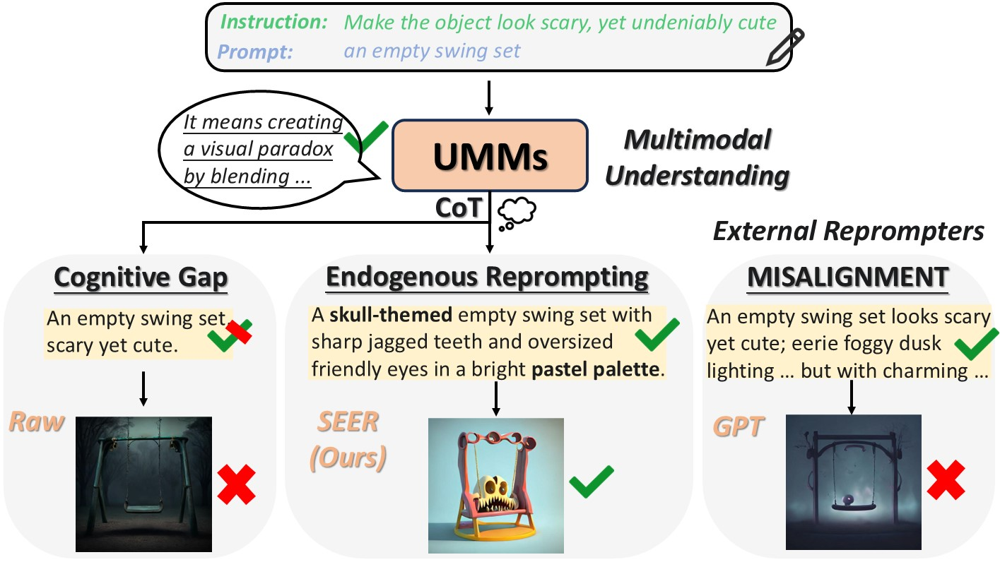
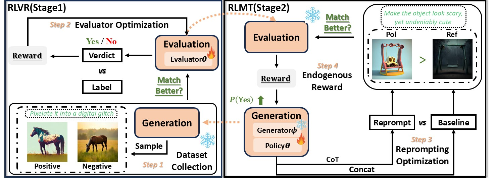

<div align="center">
  <h1>🔥(SEER) Endogenous Reprompting: Self-Evolving Cognitive Alignment for Unified Multimodal Models</h1> 
<div>
    <a href="https://github.com/2kxx/" target="_blank">Zhenchen Tang</a><sup>12</sup>,
    <a href="https://songlin1998.github.io/" target="_blank">Songlin Yang</a><sup>3</sup>,
    <a target="_blank">Zichuan Wang</a><sup>12</sup>,
    <a href="https://scholar.google.com/citations?user=YNW7o7IAAAAJ&hl=zh-CN" target="_blank">Bo Peng</a><sup>1</sup><sup>#</sup>,
    <a target="_blank">Yang Li</a><sup>12</sup>,
    <a target="_blank">Beibei Dong</a><sup>12</sup>,
    <a href="https://scholar.google.com/citations?user=cf4RSDoAAAAJ&hl=zh-CN&oi=ao" target="_blank">Jing Dong</a><sup>1</sup><sup>#</sup>,
</div>

<div>
  <sup>1</sup>New Laboratory of Pattern Recognition, Institute of Automation, Chinese Academy of Sciences <br>
  <sup>2</sup>School of Artificial Intelligence, University of Chinese Academy of Sciences <br>
  <sup>3</sup>MMLab@HKUST, The Hong Kong University of Science and Technology  
</div>

<div><sup>#</sup>Corresponding authors</div>

[](https://arxiv.org/pdf/2601.20305)
[](https://2kxx.github.io/SEER.github.io/)
[]()
[]()
[](https://github.com/2kxx/SEER?tab=readme-ov-file#-citation)
</div>

## Introduction


<div style="max-width: 850px; margin: auto; font-size: 16px; line-height: 1.75; text-align: justify;">
  <p>
Unified Multimodal Models (UMMs) exhibit strong understanding, yet this capability often fails to effectively guide generation.
We identify this as a <strong>Cognitive Gap</strong>: the model lacks an explicit mechanism to leverage its understanding to improve its own generation process.
To bridge this gap, we propose <strong>Endogenous Reprompting</strong>,, a mechanism that transforms the model’s understanding from a passive encoding process into an explicit generative reasoning step by generating self-aligned descriptors during generation.
To achieve this, we introduce <strong>SEER (Self-Evolving Evaluator and Reprompter)</strong>, a training framework that establishes a two-stage endogenous loop using only 300 samples from a compact proxy task, Visual Instruction Elaboration.
First, <strong>Reinforcement Learning with Verifiable Rewards (RLVR)</strong> activates the model’s latent evaluation ability via curriculum learning, producing a high-fidelity endogenous reward signal.
Second, <strong>Reinforcement Learning with Model-rewarded Thinking (RLMT)</strong> leverages this signal to optimize the generative reasoning policy.
Experiments show that SEER consistently outperforms state-of-the-art baselines in evaluation accuracy, reprompting efficiency, and generation quality, without sacrificing general multimodal capabilities.capabilities.

  </p>
</div>

---

## 🛠️ Methodology

### 🧠 Cognitive Gap
<p align="center">
  
  <br>
  <em>Figure 1: Bridging the cognitive gap.</em>
</p>

### 🏗️ Model Architecture
<p align="center">
  
  <br>
  <em>Figure 2: The two-stage training framework of SEER.</em>
</p>

---

## 🚀 Project Status
- **[Coming Soon]**: The full codebase and pre-trained weights will be released upon paper acceptance.
- [❌] Code Release
- [❌] Model Weights (1.5B)
- [❌] Training Dataset

## 📜 Citation
If you find SEER helpful for your research, please cite:
```bibtex
@misc{tang2026endogenousrepromptingselfevolvingcognitive,
      title={Endogenous Reprompting: Self-Evolving Cognitive Alignment for Unified Multimodal Models}, 
      author={Zhenchen Tang and Songlin Yang and Zichuan Wang and Bo Peng and Yang Li and Beibei Dong and Jing Dong},
      year={2026},
      eprint={2601.20305},
      archivePrefix={arXiv},
      primaryClass={cs.AI},
      url={https://arxiv.org/abs/2601.20305}, 
}
```

## 🙏 Acknowledgement
This work is based on [Harmon](https://github.com/wusize/Harmon). Sincerely thanks for this awesome work.
